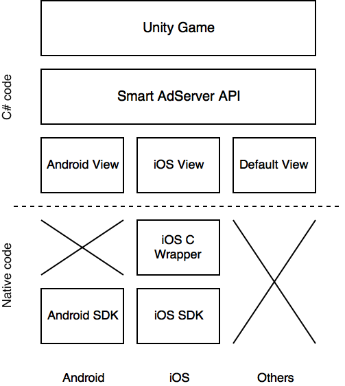

# Implementation

## Main structure

### Unity native plugin

The integration of a mobile SDK can be made using the native plugin capability provided by Unity: http://docs.unity3d.com/Manual/NativePlugins.html

Using this capability, _Unity_ will allow direct or indirect access to native code if the application is running on the targeted platform. This plugin feature will also allow us to make specific configurations depending on the platform currently used (to request permissions if the application on _Android_ for example).

This sample is divided in several layers:

1. the **Unity Game** itself
2. a **Smart AdServer API** layer to provide a standard C# API used to load and display ads
3. a **native ad view** layer that will instantiate and handle ad views for supported platforms (in this sample: _Android_, _iOS_ and _'Default'_)
4. a **C wrapper** layer that will provide a C interface for SDK that can't be accessed directly through managed code (only required for _iOS_ in this sample)
5. a **SDK** layer (the _Android_ and the _iOS_ SDK)

<p align="center">
  
</p>

## Integration of the Android SDK

### SDK integration

To display ads on _Android_, you need to embed the _Android SDK_ and the _Google Play Services_ library.

Embedding a file in the app for _Android_ is done by creating a directory in the _Plugins_ directory, in this case: ```Assets/Plugins/Android/```.

You also need to provide an _AndroidManifest.xml_, to setup the permissions for the _Android SDK_ (*ACCESS_NETWORK_STATE* and *INTERNET*). This manifest will be merged automatically with the _Unity_ manifest during compilation.

### Interacting with Java classes from Unity

Interacting with _Android_ classes and objects is quite easy with _Unity_.

You can do it directly from _C#_ (without the need of a native _Java_ wrapper) using _Unity_ classes ```AndroidJavaClass``` and ```AndroidJavaObject```. You can also use the ```AndroidJavaProxy``` class to create a listener for a Java class with _C#_ code.

**Warning:** When you are executing Java code from _Unity_, you are not guaranteed that it will be executed in the application main thread. This can lead to crashes when interacting with views.

The class ```AndroidNativeAdView``` from this sample project shows you how to manipulate the _Java_ ```SASAdView``` class from _C#_ and how to run your code on the _Java_ main thread (look for the ```RunOnJavaUiThread``` method).

_In this sample, the code to interact with_ Java _classes can be found at ```Assets/Plugins/SmartAdServer/API/UI/Native/AndroidNativeAdView.cs```_

### Z-Order issue with UnityActivity since Unity 5.6

**_This issue has been fixed in Unity 5.6.2. The wrapper still implements the z-order workaround but it is not necessary anymore._**

Since _Unity 5.6_, ads are not visible without doing some modifications on the Unity Player window, activity and on the ```SurfaceView``` used for the rendering.

This is done by using the ```com.smartadserver.android.library.unity.UnityPlayerActivity``` instead of the default ```UnityPlayerActivity``` by using a custom AndroidManifest.xml. This custom class is provided as a binary in _AndroidUnityLibrary.jar_.

If you want to rebuild a custom version of ```com.smartadserver.android.library.unity.UnityPlayerActivity```, you can do it by using the _Android_ project available in ```AndroidUnityLibrary/``` and running the ```makeJar``` _gradle_ task from _Android Studio_ or from command line by running:

      ./gradlew makeJar

The built library will then be available in ```AndroidUnityLibrary/library/build/outputs/jar/library.jar```.

## Integration of the iOS SDK

### SDK integration

To display ads on _iOS_, you need to embed the _iOS SDK_ in the ```Assets/Plugins/iOS/```:

* the ```.a``` Library
* all header files
* the bundle file

You will also need to import the right frameworks in the app and deactivate _Apple Transport Security_ (since third party scripts might not support HTTPS yet).

This is done in the ```iOSPostprocessBuild``` class, through the method ```LinkLibraries``` for the frameworks import and ```DeactivateATS``` for the _Apple Transport Security_ deactivation.

Since _Unity_ does not provide any API to manipulate _iOS_ projects, these two methods are directly modifying _Xcode_ project files.

### Interacting with ObjC code from Unity

It is not possible to manipulate _ObjC_ classes directly from _C#_ code, so you will not be able to instantiate _iOS_ ```SASAdView``` objects from a _Unity_ class like it is done from _Android_.

This sample relies on a **C wrapper** that will instantiate, configure and display the ad view instances into the app. The ```iOSNativeAdView``` _Unity_ class will only be used to call the _C wrapper_ functions.

Every ```SASAdView``` instances created in the _C wrapper_ is associated with an **ID** which will be returned to the ```iOSNativeAdView``` _Unity_ class.

The number of valid _IDs_ is fixed in the current _C wrapper_ implementation. This will probably be changed in a future version: in the meantime, if you want to change the number of _IDs_, you can edit the variable ```MAX_AD_VIEW``` in the file ```SmartImpl.mm```.

## Adding an unsupported method call to the adapter

If you need to call a method of the SDK that is not handled by the adapter, you can add it yourself:

1. Add the abstract method you need in the ```NativeAdView``` class.

2. Add the method implementation for each implementation of ```NativeAdView``` (```AndroidNativeAdView``` and ```iOSNativeAdView``` for now). Check _Interacting with Java classes from Unity_ and _Interacting with ObjC code from Unity_ if you need more informations on how to develop and native implementation for each plaform.

3. Add the method in ```AdView```, in ```BannerView``` or in ```InterstitialView``` depending if the method will be used on banners, on interstitials or on both.

4. The newly created ```AdView``` method should then get the native ad view using ```GetNativeAdView()``` and call the newly created method.

## Adding support for a new platform

You may want to call ads on another platform (for instance using direct calls to the API or web creatives). You can add support for another platform supported by _Unity_ by following these steps:

1. Add a new implementation of the abstract class ```NativeAdView```. If you are calling native code from this platform, remember to surround it with conditional preprocessor instructions like ```#if #endif``` or your project will not build anymore on other platforms.

2. Add a new implementation of the abstract class ```NativeAdViewBuilder```. This class will only be used to instantiate an instance of your native ad view.

3. Add your new builder as a case for the switch that you'll find in the ```ConfigurePlatform``` method.

The adapter will now call your native ad view when running on the right platform. If you forgot anything, the ```DefaultNativeAdView``` will be called instead (this class only displays console logs).
