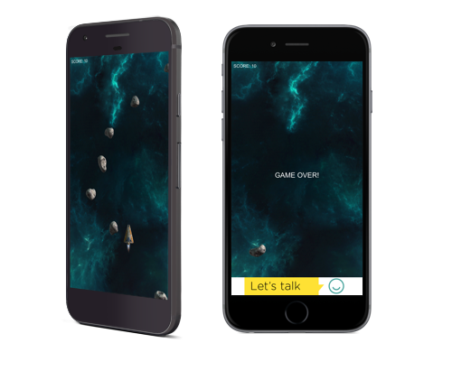

# Smart AdServer / Unity — Integration Sample

## 1. Getting started

To get started, simply checkout this project and open it using the latest version of _Unity_ (tested on *Unity 5.4.0f3*).

This project is based on the official _Space Shooter_ tutorial available [in _Unity_ official documentation](https://unity3d.com/learn/tutorials/projects/space-shooter-tutorial). It has been modified to handle accelerometer input, thus making it playable on mobile devices.

  

When the project is run through the _Unity Editor_ or as any build target except _Android_ & _iOS_, the game will run properly without any ads being displayed. If the same project is run as an _Android_ or an _iOS_ target, a banner and an interstitial ad will be fetched using the embedded _Smart AdServer Display SDK_ and will be displayed to the player when he loses.

## 2. Integration

If you are looking for help to integrate the current _Unity Adapter_ into your project or to load and display an ad, you can find more informations into the integration guide.

> [Integration guide](integration.md)

## 3. Implementation

The _Unity Adapter_ is designed to be extended. You might want to add more features or to expand it to other platforms.

This section describes the architecture of the adapter, the specificity of each platform integration and contains a quick guide on how to add support for another platform.

> [Implementation details & platforms integration](implementation.md)

## 4. More informations

Before opening an issue on _GitHub_ or contacting support, please check that your question is not answered in our FAQ:

> [Frequently asked questions](faq.md)

The _Unity Adapter_ might contain some bugs or known performance issues when displaying ads, you can check all of them here:

> [Known issues and improvements needed](known_issues.md)
