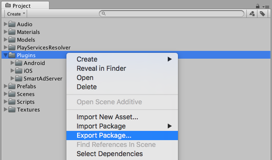

# Integration guide

> **WARNING**

>_Temporary documentation, please refer to the official documentation for now_

## 1. Adding the adapter into an existing project

You can integrate the _Unity Adapter_ into you project by simply merging the ```Assets/Plugins``` directory found in this repository into your own _Assets_ directory. This directory contains all files necessary to display ads on _Android_ & _iOS_, included _Smart AdServer_ SDK for both platforms.

To simplify this step, you can export the whole _Plugins_ directory as an _Unity Package_ file by right-clicking it, then choosing _Export Package_. Leave everything selected in the pop up displayed next and choose a filename to complete the operation.

<p align="center">
  
</p>

A _Unity Package_ can be imported into another project by double clicking it when the project you want to import them into is open.

## 2. Displaying an ad

_TODO_

### Banner

_TODO_

### Interstitial

_TODO_
